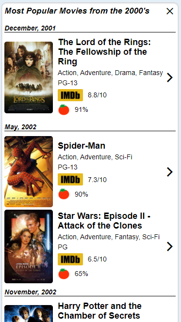

# Timeless Movies Application

 Timeless Movies is an app designed for searching highest grossing films of a given time period as well as individual movie searches. Users can search highest grossing films by decade or selected year. The individual movie search bar provides users with information about the chosen film along with a poster of that film. Film information includes: Title, Genre, Rating, Actors, Director, Release Date, IMDB score, Rotten Tomatoes score, Film length, Plot, and Awards. This site is designed to be easy to use and navigate. 

## Timeless Movies was created with the following languages and applications:
 - HTML
 - CSS (Pure CSS)
 - JavaScript (JQuery & moment.js)

## Server-side APIs Used
 - Wikipedia API: to gather a list of movies for a given year and decade
 - OMDB API: to return information for individual movies

## Deployed Website:
[Website](https://dalyd14.github.io/movie-timeline)

## Screenshots

